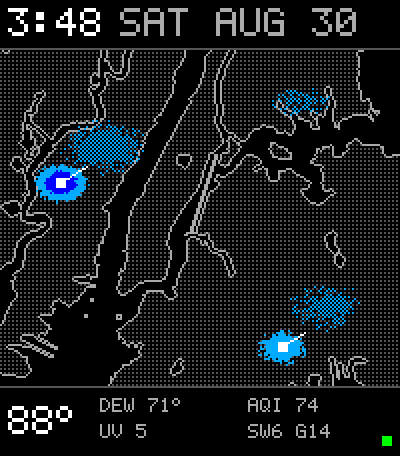
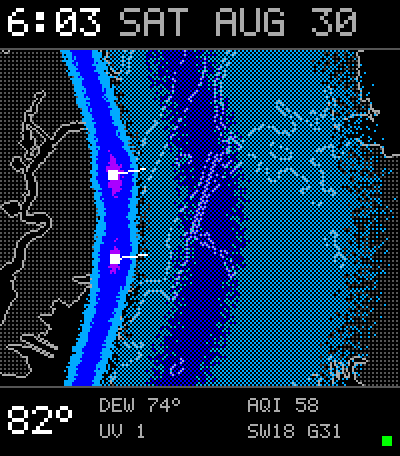
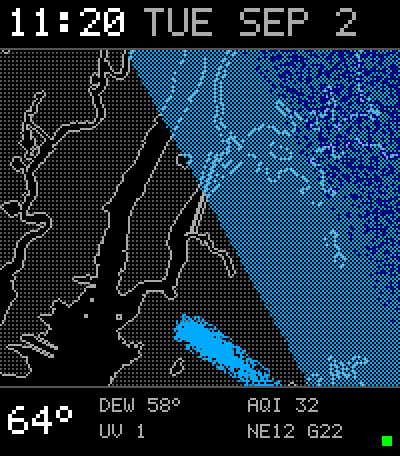
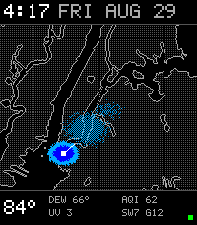

# Purple Rain

A silent 0–2 hour nowcast watchface for the Pebble Time 2, over a real map of
New York harbor. One source per element, no fallbacks:

- **Solid pixels** — what the MRMS radar mosaic sees *right now* (2-min).
- **Dithered pixels** — wherever the latest HRRR sub-hourly run puts rain in
  the *next two hours* (hourly, 15-min steps).
- **White vectors** — ProbSevere's measured motion on storms the radar
  currently sees: square base at the cell, bare shaft, no arrowhead.
- **Color** — intensity, blue → purple: `#00AAFF` rain, `#0000FF` heavy
  (≥1″/h), `#AA00FF` severe (≥2″/h).
- **Rail** — current obs, all gray: temp/dew from KNYC (the official Central
  Park thermometer), wind/gust from KLGA (a properly sited airport
  anemometer — Central Park's reads ~0 under the tree canopy), UV and AQI
  from Open-Meteo. Health dot bottom-right: green = fresh, yellow = HRRR late,
  red = radar stale.

Spec: https://claude.ai/code/artifact/2d656229-dc7e-47f2-9920-4aa3866abd0f

## What it looks like

| | |
|:---:|:---:|
|  **Popcorn afternoon** — two cells on radar, motion vectors set, plumes where HRRR carries them next |  **Squall line on the Hudson** — bowed solid line, purple core at the apex, two hours of trailing rain dithered ahead |
|  **Coastal brush** — stratiform sheet grazing Brooklyn and Queens, one wet finger on the waterfront, no cells to track |  **Lone harbor cell** — heavy core over the Upper Bay, headed northeast, plume over lower Manhattan |

## Layout

- `watchapp/` — Pebble C app (SDK 4.x, platform `emery`). `src/c/masks.h` is
  the baked 1-bit cartography (generated by `cartography/makemap.py` from
  Census cb_2023 shorelines minus TIGER area-water).
- `pipeline/` — uv project; `uv run purple-rain out.json` builds the payload.
- `scripts/publish.sh` — build + PUT to the Cloudflare Worker
  (`pebble-wx.sam-2d3.workers.dev/wx/purple.json`, worker source lives in
  pebble-wx `infra/cloudflare/`). Token in `~/.config/pebble-wx/cloudflare.env`.
- `systemd/` — user units, every 5 minutes. Install:
  `cp systemd/* ~/.config/systemd/user/ && systemctl --user enable --now purple-rain.timer`

## Wire format

`GET /wx/purple.json` → `{v, gen, cells, vecs, temp, dew, uv, aqi, wind, health}`
where `cells` is 525 hex bytes (25×21 grid of 8-px cells over the map; low
nibble = now, high nibble = next-2h, each a 16-step log intensity that the
watch bilinearly interpolates into smooth per-pixel fields) and `vecs` is up to six
`[x, y, dx, dy]` pixel vectors. ~1.3 KB. The watch polls every 5 minutes and
redraws only on change.

Cloudflare free tier headroom: 288 KV writes/day (limit 1 000), ~600 reads/day
(limit 100 000).
